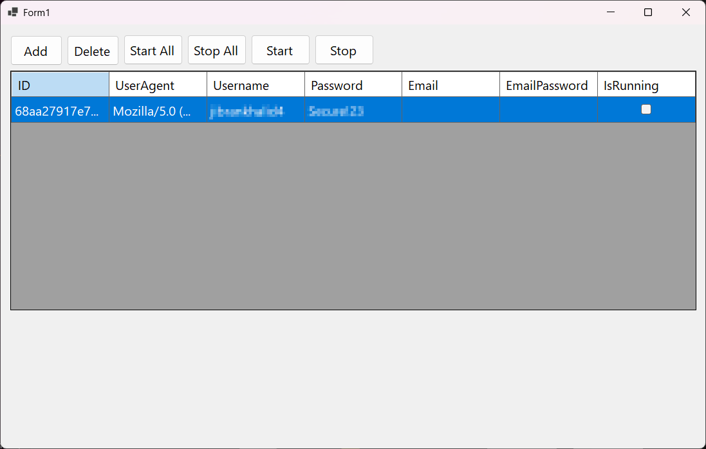
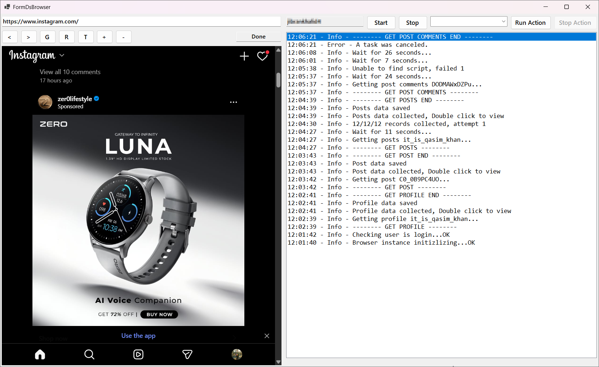
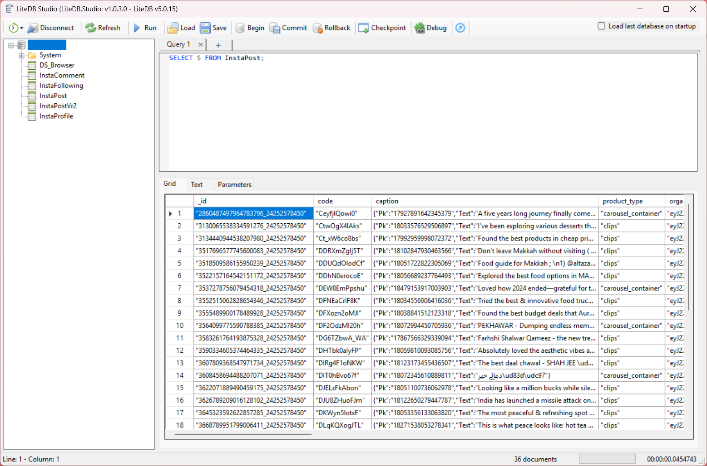

# 📸 Instagram Data Scraper (Fully GUI-Based)

An **intuitive, user-friendly, and fully GUI-based Instagram Data Scraper** designed for everyone — no coding skills required! With a **sleek interface** and **real-time progress tracking**, you can easily scrape Instagram data like posts, profiles, followings, and comments.  

> ⚡ Perfect for **market research**, **influencer analysis**, and **content monitoring** — while ensuring compliance with Instagram’s Terms of Service.  

---

## ✨ Features

✅ **Unlimited Instagram Accounts** – Use 20+ accounts with the same IP address  
✅ **Parallel Execution** – Run multiple accounts simultaneously  
✅ **Smart Request Limit Controller** – Prevents account blocking or tracking  
✅ **Beautiful GUI** – User-friendly with task progress tracking  
✅ **LiteDB Integration** – Efficient local storage of scraped data  
✅ **JSON Export** – Store scraped data in JSON format  

---

## 🔍 What Can Be Scraped?

- 👤 **User Profile**  
- 🖼️ **User Profile Posts**  
- 📌 **Single Post**  
- 🔗 **User Followings**  
- 💬 **User Post Comments**  
- 📥 **User Followers** *(coming soon 🚧)*  
- ↩️ **User Post Comment Replies** *(coming soon 🚧)*  
- 🌐 **Public APIs** to run tasks from any language *(coming soon 🚧)*  

---

## 🛠 Requirements

Before running the scraper, make sure you have:  

- [.NET Core 9+](https://dotnet.microsoft.com/en-us/download/dotnet) ⚙️  
- [LiteDB](https://www.litedb.org/) 💾  

---
## 🖼️ GUI Preview

<p align="center">
  
  
  
</p>

---

## 🚀 Getting Started

1. **Clone this repository**  
   ```bash
   git clone https://github.com/zohaibmultan/instagram-data-scraper.git
   cd instagram-data-scraper
   ```

2. **Change Database Connection String**
   ```
   File Path -- Common/DbHelper.cs

   public static class DbHelper
   {
        private static string connectionString = @"Filename=<Path to your database>\<database name>.db;Connection=shared";
        ...
        ...
   }
   ```
2. **Build & Run**  
   ```bash
   dotnet build
   dotnet run
   ```

3. **Launch the GUI** and start scraping 🎉  

---

## 📊 Example Use Cases

- 📈 Marketing Teams → Analyze competitors & audience engagement  
- 🤝 Influencers → Track followers and interactions  
- 📰 Researchers → Monitor trends and content performance  

---

## 📌 Roadmap

- [ ] Followers scraping  
- [ ] Comment replies scraping  
- [ ] Public APIs for external integrations  
- [ ] Cloud deployment support  

---

## 🤝 Contributing

Contributions are welcome!  
Feel free to **fork this repo** and submit a **pull request**. 🚀  

---

## 📜 License

This project is licensed under the **MIT License** – free to use, modify, and distribute.  


Last Updated - 2025-09-01